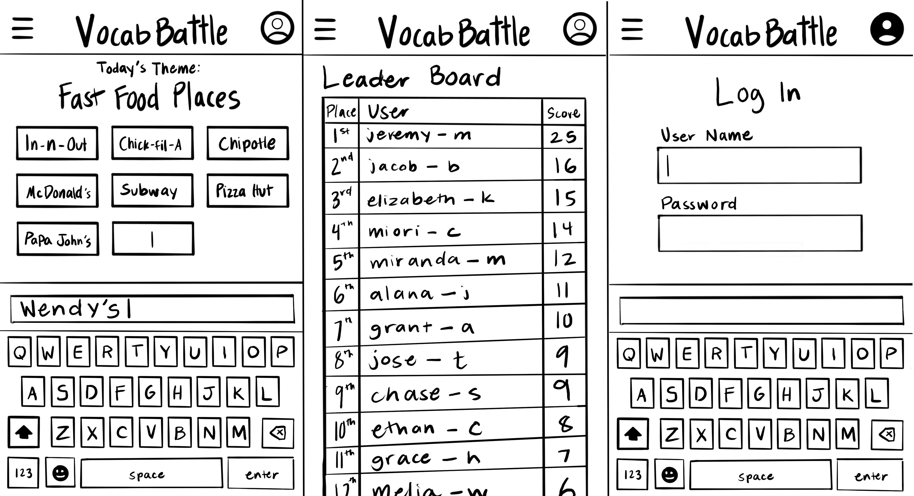

# Vocab Battle

## Specification Deliverable 
### Elevator Pitch
Have you ever wanted to use your knowledge of vocabulary to compete against your friends and family? Have you ever wanted a fun application to help you expand your vocabulary even further? This application allows you to use your knowledge of vocabulary to come up with as many words that match the starting category in 60 seconds. Your score will then be pitted against your friends' and family's scores to determine who has the best vocabulary in that category. This fast paced game is a quick and easy way to connect with (and compete against) your friends and family each day!

### Design
Below are three sketches of what the interface will look like on a phone: 

### Key Features
- Users will be able to see each other's scores in real time
- Users can create an account to store their scores
- The game updates every day with a new category for users to interact with
- Fast, automatic game play (users only need to worry about typing)
- Answers are checked for validity by the application
- Answers can be contested or put up for vote for half points

### Technologies
- **HTML** - Using HTML for structure. 3-4 HTML pages, one for score, login, game play, and information if they aren't sure how to play.
- **CSS** - Application styling for different screen sizes
- **React** - Users can type their answers and submit them, use buttons to interact with the game
- **Service** - Backend service for retrieving the category of the day and entering new user scores into the application
- **DB/Login** -  Store users and scores in database. Register and login users. Credentials securely stored in database. Can't see the leaderboard unless authenticated
- **Websocket** -  Leaderboard allows users to see each other's scores

## HTML deliverable

For this deliverable I built out the structure of my application using HTML.

- [x] **HTML pages** - I created four HTML pages for structure with content. They represent the main play page, the score page, the instructions page, and the leaderboard page.
- [x] **Links** - The play page automatically links to the other pages via a menu item.
- [x] **Interaction** - I added HTML buttons as placeholders for future interaction. Currently, they don't do anything.
- [x] **Images** - I included an image for the instructions page, but it will need to be updated as I add the CSS and the play page looks different.
- [x] **DB/Login** - I added an input box and submit button for login, but it doesn't store itself in a database yet.
- [x] **WebSocket** - I added a leaderboard that represents a hypothetical leaderboard. It is a placeholder.
- [x] **Third Party Service Calls** - I added a placeholder for third party service calls that will check user's answers for validity and retrieve category of the day.